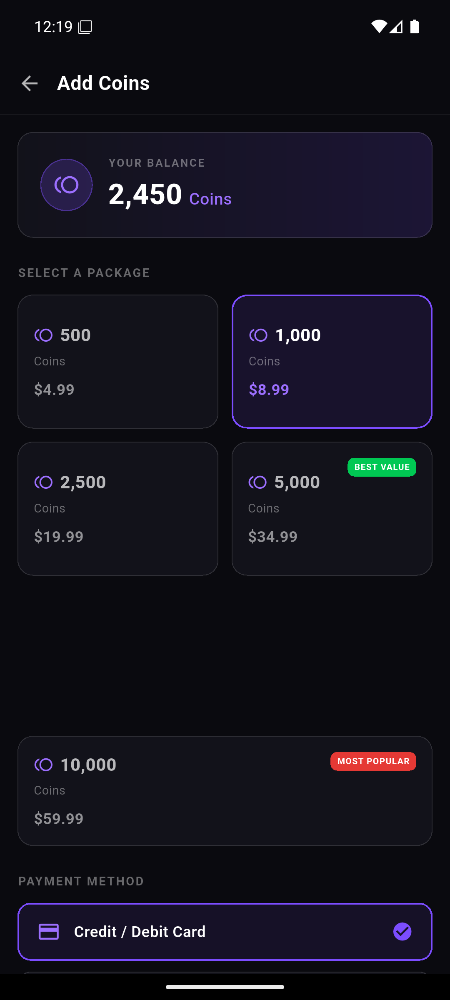
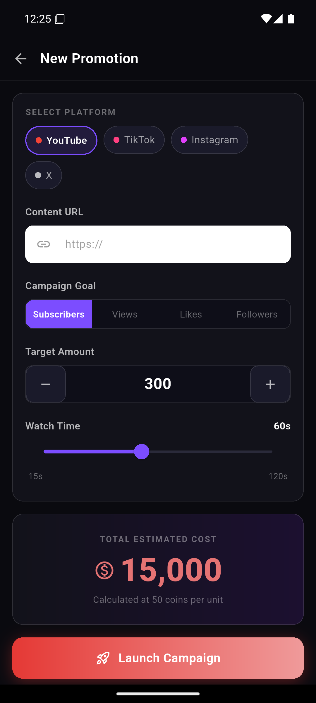
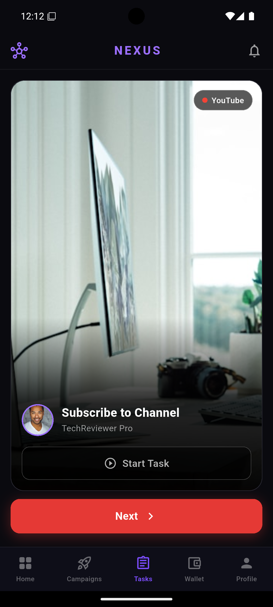

# YouTube Creator Dashboard App

A professional Flutter application designed for content creators to manage their campaigns, track coin balances, and upgrade their VIP status. This project showcases modern Flutter development practices, including custom UI components, complex navigation, and a structured architecture.

## 🚀 Key Features

*   **Dynamic Dashboard**: Overview of user balance, VIP status, and featured campaigns.
*   **Campaign Management**: interactive carousel for viewing and managing content promotions.
*   **Coin Economy**: Dedicated screen for purchasing coin packages with integrated payment method selection.
*   **VIP System**: Tiered membership system with custom progress tracking.
*   **Modern UI/UX**: Built using Material 3, custom gradients, and responsive layouts.

## 🛠️ Tech Stack

*   **Framework**: [Flutter](https://flutter.dev)
*   **Language**: [Dart](https://dart.dev)
*   **Design System**: Material Design 3
*   **State Management**: StatefulWidget (scalable architecture)

## 📁 Project Structure

The project follows a clean and modular architecture:

*   `lib/screens/`: High-level UI screens (Dashboard, Add Coins, etc.)
*   `lib/widgets/`: Reusable UI components and specialized cards.
*   `lib/models/`: Data classes for campaigns, users, and transactions.

## 📸 Screenshots

<p align="center">
  
  
  
</p>

---

## 🏗️ Getting Started

### Prerequisites

*   Flutter SDK (v3.0.0 or higher)
*   Dart SDK (v3.0.0 or higher)

### Installation

1. Clone the repository:
   ```bash
   git clone https://github.com/ueljames379-debug/youtubeproj.git
   ```
2. Fetch dependencies:
   ```bash
   flutter pub get
   ```
3. Run the app:
   ```bash
   flutter run
   ```
